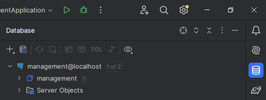
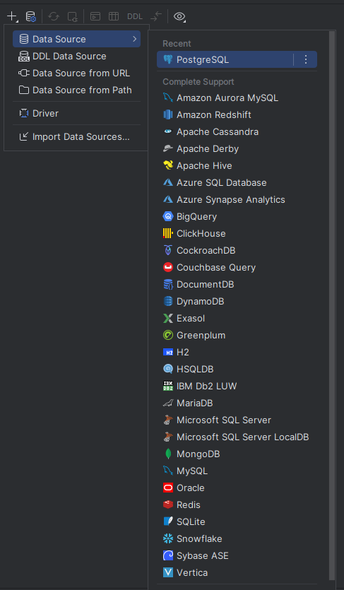
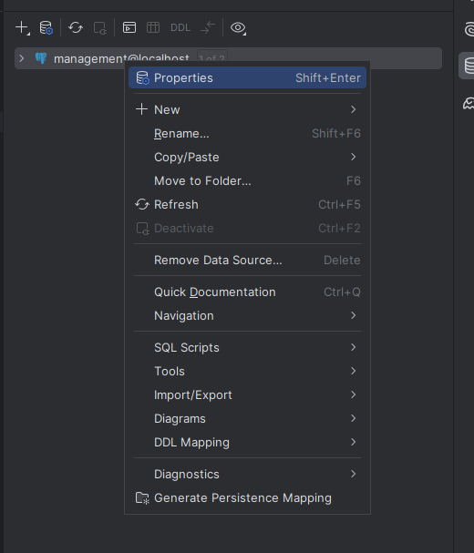
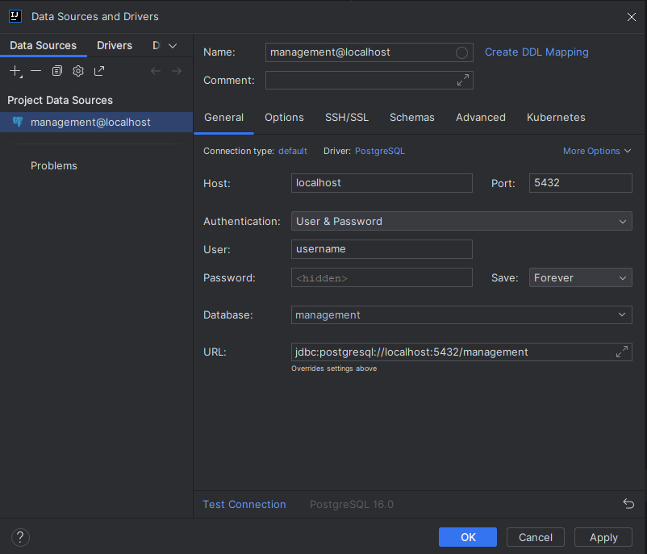

# Jak uruchomić bazę danych?

## UWAGA!!
## a) Na początku upewnij się, że nie masz zainstalowanego PostgresSQL Server na komputerze. Powoduje to błąd przy logowaniu się do bazy.
## b) Zainstaluj dockera

## 1. Uruchom Dockera. Usuń poprzednie kontenery i woluminy związane z tą bazą.
## 2. W Intellij'u kliknij na ikonkę bazy. (Jest w prawym górnym rogu) <br> 
## 3. Następnie kliknij w '+' -> DataSource i wybierz PostgreSQL. <br> 
## 4. Kliknij prawym przyciskiem w wejście, które się pojawiło i przejdź do properties. <br> 
## 5. Ustaw wszysko tak jak na poniższym screenie; password to 'password'. <br> 
## 6. Uruchom terminal z katalogu głównego `management` i wykonaj w nim polecenie:<br> ```'docker-compose -f .\docker\docker-compose.yml up --force-recreate'```  
## 7. Wykonają się skrypty znajdujące się w `management/docker/db` i baza zostanie uzupełniona.
## 8. Do bazy można dodawać wartości, jednak jeżeli chcemy, żeby były one dostępne za każdym razem kiedy zaczynamy pracę z aplikacją należy nadpisać skrypty w `.sql` w folderze `/db`.
### 8.1 Uwaga. W przypadku dodawania nowych skryptów polecam nazywać je tak, aby nazwy były późniejsze w kolejności alfabetycznej. Skrypty wykonują się "od góry do dołu", więc jeśli jakiś plik będzie przed inicjalizacją to otrzymamy błąd itd..